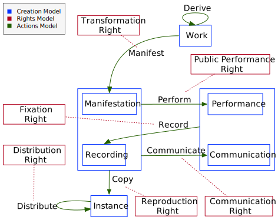

# CopyrightOnto - Copyright Ontology
_**A Copyright Ontology for Content Rights Management**_

An ontology is a formalisation of concepts and relations within a domain. The Copyright Ontology tries to formalise the copyright domain as a way to facilitate automated (or computer-supported) copyright management through the whole content value chain, as it is shaped by copyright law. Therefore, it does not focus just on the last step, end-users permissions to consume content, like many rights languages and ontologies do.  

It is a Web Ontology, and thus it is implemented using the World Wide Web Consortium (W3C) standards Resource Description Framework ([RDF](https://de.wikipedia.org/wiki/Resource_Description_Framework)) and Web Ontology Language ([OWL](https://en.wikipedia.org/wiki/Web_Ontology_Language)).

## Approach
The copyright domain is quite complex, so the **Copyright Ontology** attempts its **conceptualisation** in **three steps**, which allows incrementally facing this process.

First, the objective is to represent the most primitive part, the **Creation Model**, the different shapes creations take along their lifecycle. Second the **Action Model**, the available actions that move creations along their life cycle. Finally, the **Rights Model**, which constraints what actions are favoured or restricted based on different legal regimes:

1. [**Creation Model**](CreationModel) - different shapes of copyright creations along their lifecycle.
2. [**Actions Model**](ActionsModel) - copyright actions moving creations along their lifecycle.
3. [**Rights Model**](RightsModel) - legal constructs regulating what actions are favoured or restricted. Different legal systems can be represented, from generic rights frameworks geared towards worldwide harmonisation like those proposed by the **World Intellectual Property Organization** ([WIPO](http://www.wipo.int)) to specific rights in a particular legal regime like the **U.S. Digital Performance Right in Sound Recordings**

Figure 1 shows and overview of how some of the concepts in these 3 models relate.

|                                          |
| :----------------------------------------------------------: |
| Figure 1. Overview of how the main concepts in the Creation, Rights and Actions Models relate |

To facilitate the adoption of the Copyright Ontology, it is **built on top of** the generic ontology provided by the [**schema.org**](http://schema.org) vocabulary, one of the best-known and more widely used data vocabularies, promoted by the leading search engines (Google, Yahoo, Bing and Yandex). An RDF version of schema.org has been used, which is automatically generated from the official [RDFa](http://schema.org/docs/schema_org_rdfa.html) version using [pyRdfa](https://www.w3.org/2012/pyRdfa) using:

[https://www.w3.org/2012/pyRdfa/extract?uri=http%3A%2F%2Fschema.org%2Fdocs%2Fschema_org_rdfa.html&format=turtle](https://www.w3.org/2012/pyRdfa/extract?uri=http%3A%2F%2Fschema.org%2Fdocs%2Fschema_org_rdfa.html&format=turtle)
